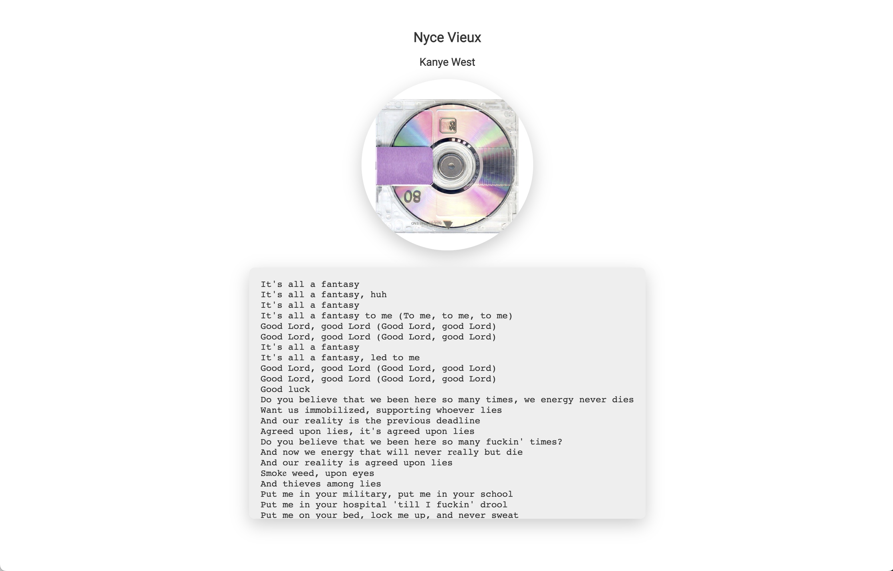

# Spotify Lyrics Sync Web
This project automatically sync what you're playing on spotify to a webpage and finds the lyrics on.

Usage: 
1. Clone this repo
2. Install all the reqirements
3. Edit app.py and change API keys for Spotify and Genius. (Google spotify api and genius api)
4. python app.py
5. Visit localhost:3000

Screenshot:

Todo:
- [ ] Rolling lyrics
- [ ] PWA Support
